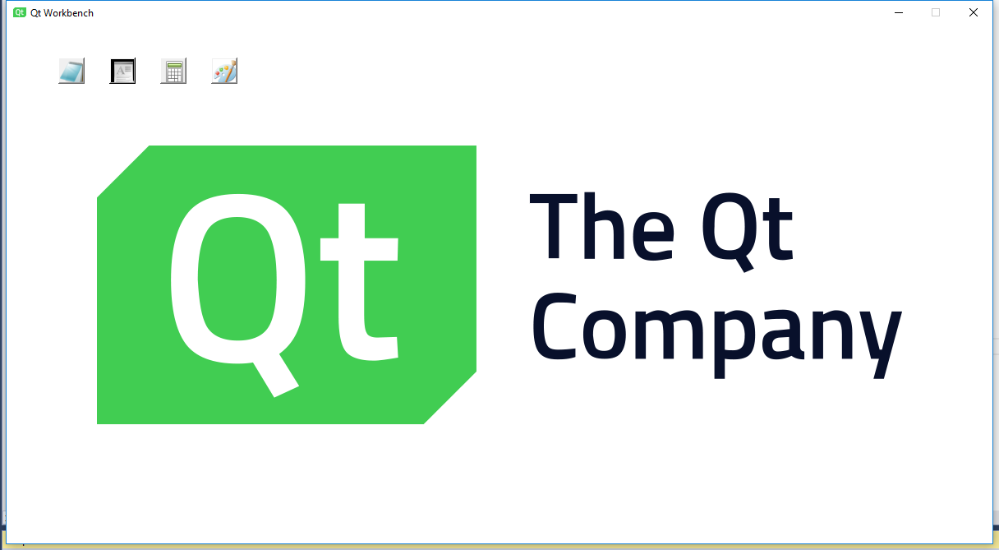

# WorkBench

当一个公司拥有很多独立产品，并想通过 License 来控制，单独收费的时候。一个启动时显示的“控制面板”显得很有必要。客户购买过 License 的产品可供点选，而未购买的，则为灰色，处于禁用状态。

这就好比是一个主页，或者是一个入口。这里我们称之为 WorkBench。

> 这是我在曾经呆过的公司做的半成品，去掉了一些敏感的信息，开源出来，供大家参考，完善。

左上角的四个方块，就是对应的四个产品。由于只是示例，所以选图比较随意，如果让美工好好设计一番，会比较出彩。